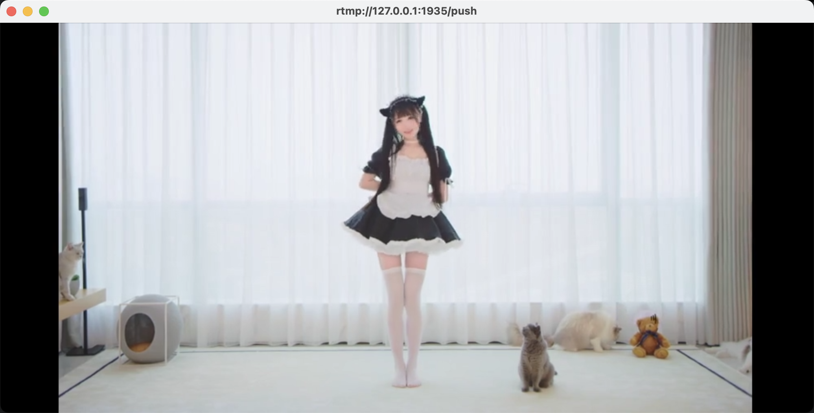

## 完整配置文件

`KPlayer`的配置文件顶级中的`play`用于配置播放器、编解码、播放策略相关参数。以下是完整的配置项


<CodeGroup>
  <CodeGroupItem title="json" active>

```json
{
  "play": {
    "start_point": 1,
    "play_model": "list",
    "encode_model": "rtmp",
    "cache_on": false,
    "cache_uncheck": false,
    "skip_invalid_resource": false,
    "fill_strategy": "tile",
    "rpc": {
      "on": true,
      "http_port": 4156,
      "grpc_port": 4157,
      "address": "127.0.0.1"
    },
    "encode": {
      "video_width": 854,
      "video_height": 480,
      "video_fps": 25,
      "audio_channel_layout": 3,
      "audio_sample_rate": 44100,
      "bit_rate": 0,
      "avg_quality": 0
    }
  }
}
```

  </CodeGroupItem>
  <CodeGroupItem title="yaml">

```yaml
play:
  start_point: 1
  play_model: list
  encode_model: rtmp
  cache_on: false
  cache_uncheck: false
  skip_invalid_resource: false
  fill_strategy: tile
  rpc:
    'on': true
    http_port: 4156
    grpc_port: 4157
    address: 127.0.0.1
  encode:
    video_width: 854
    video_height: 480
    video_fps: 25
    audio_channel_layout: 3
    audio_sample_rate: 44100
    bit_rate: 0
    avg_quality: 0

```

  </CodeGroupItem>
</CodeGroup>


## 起始位置

<CodeGroup>
  <CodeGroupItem title="json" active>

```json {3}
{
	"play": {
		"start_point": 1
	}
}
```

  </CodeGroupItem>
  <CodeGroupItem title="yaml">

```yaml {2}
play:
  start_point: 1
```

  </CodeGroupItem>
</CodeGroup>


`start_point`配置视频列表的起始索引位置，使用非0的自然数自增，默认值为`1`从列表的起始位置开始播放。修改这个值影响**首次循环**时起始的循环起始位置。

::: tip 提醒

该值只针对首次循环的起始值有效，不影响首次循环后的起始值

:::

## 播放模式

<CodeGroup>
  <CodeGroupItem title="json" active>

```json {3}
{
  "play": {
    "play_model": "loop"
  }
}
```

  </CodeGroupItem>
  <CodeGroupItem title="yaml">

```yaml {2}
play:
  play_model: loop
```

  </CodeGroupItem>
</CodeGroup>


`play_model`  可以配置常规的播放模式，例如顺序播放、循环播放、随机播放等模式。

该项需要配置为字符串类型，支持的值有

| 值     | 说明                                                         | 默认值 |
| ------ | ------------------------------------------------------------ | ------ |
| list   | 列表顺序播放                                                 | 是     |
| loop   | 列表顺序播放并且播放完最后一个资源后重新至起始位置循环       | -      |
| random | 随机播放，列表随机播放                                       | -      |
| queue  | 队列模式，该模式下播放完资源列表后不会直接结束将会阻塞等待新的资源加入（通过cli、api添加) | -      |


## 编码模式

<CodeGroup>
  <CodeGroupItem title="json" active>

```json {3}
{
  "play": {
    "encode_model": "rtmp"
  }
}
```

  </CodeGroupItem>
  <CodeGroupItem title="yaml">

```yaml {2}
play:
  encode_model: rtmp
```

  </CodeGroupItem>
</CodeGroup>


`encode_model`  可以配置编码模式。`KPlayer`不仅仅支持推流，它也可以作为视频解编码工具使用，可以将预期的视频内容输出到本地文件中。

该项需要配置为字符串类型，支持的值有

| 值   | 说明                                 | 默认值 |
| ---- | ------------------------------------ | ------ |
| rtmp | 推流模式，按照时钟时间戳进行编解码   | 是     |
| file | 文件编码模式，按照帧时间戳进行编解码 | -      |


## 开启缓存

<CodeGroup>
  <CodeGroupItem title="json" active>

```shell {3}
{
	"play": {
		"cache_on": false
	}
}
```

  </CodeGroupItem>
  <CodeGroupItem title="yaml">

```yaml {2}
play:
  cache_on: false

```

  </CodeGroupItem>
</CodeGroup>


缓存作为`KPlayer`的一项核心功能，可以在缓存文件存在的情况下不进行二次编解码大大释放CPU和内存占用量，开启缓存并使用有效的缓存后对资源占用的效果是显著的。所有如果你的服务器无法支撑正常的编解码性能或者不期望占用过多的服务资源的话，你可以开启此选项来减低资源占用。

<br/>

**默认关闭缓存**，开启此选项后在首次推流时仍然会对资源编解码推流并同时在`homedir`下创建`cache`目录存放与资源同名的`kpc`文件。


::: warning 注意

缓存的设计旨在保存编解码时的视频快照避免二次编解码，所以在成功生成缓存后对影响视频内容的插件增删将会失效。同样像使用了打印当前时间的插件在生成缓存后，时间也将永远显示生成缓存时刻的时间

:::


如果你对插件有增删的情况需要重新生效，重新生成缓存删除cache目录后重新运行即可

<br/>

如果开启了缓存选项在打开视频资源后，`KPlayer` 将会在cache目录中查找同名的缓存文件。如果缓存文件存在，`KPlayer`将会对缓存文件与原视频资源的参数一致性进行校验。

校验的规则包括以下几项：


* **缓存文件分辨率(video_with, video_height)与当前配置文件设置分辨率一致**

  

* **缓存文件质量系数(avg_quality)一致**

* **缓存文件质量系数(bit_rate)一致**

* **缓存文件帧率(video_fps)一致**

* **缓存文件编码类型一致**

* **缓存文件音视频解码器一致**

* **缓存文件音频采样率与通道数一致**

* **缓存文件缩放策略(scale_strategy)一致**

* **源视频文件总时长与缓存时长一致**

* **视频资源文件被正确的完整生成缓存文件**


<br/>缓存文件的命中严格遵循这几项规则来校验缓存文件与源文件是否保持属性一致性，确保缓存可以按照预期的结果来使用。


::: tip 提醒

当缓存正确完整的生成`KPlayer`将会在文件头写入一个`END_MAGIC`，它的值为十六进制的`0x2244`

未完整写入文件不仅仅在中途结束程序导致，使用 `skip`相关API接口同样会被视为缓存未正确生成

:::


当运行`KPlayer`后，观察日志是否成功使用缓存

正确开启缓存在打印日志中会新增`hit_cache`一项，它的`true`或`false`可以获知是否开启缓存已经缓存的命中情况

```shell
INFO[2022-08-30 13:38:07] checked play resource     duration=173 hit_cache=false path="/home/user/video/起风了.flv" unique=YJBJFn
```


::: tip 提醒

如果你只是想生成缓存，不想等待完整的视频资源播放一次。你可以<router-link to="/option/play.html#开始运行">查看这里</router-link>寻找只生成缓存并不推流的方法

:::

## 跳过检查缓存有效性

<CodeGroup>
  <CodeGroupItem title="json" active>

```json {3}
{
	"play": {
		"cache_uncheck": false
	}
}
```

  </CodeGroupItem>
  <CodeGroupItem title="yaml">

```yaml {2}
play:
  cache_uncheck: false
```

  </CodeGroupItem>
</CodeGroup>


在使用缓存中介绍的在开启缓存后会必要的检查源文件和缓存文件以及配置文件相关参数是否一致，这需要在完整生成缓存之后你仍然需要保证原视频资源具备可读性，这样做的目的为了防止在进行个性化配置编码参数或插件资源后无法找到源文件造成无法二次生成缓存的问题。

如果这个策略给你造成的困扰，`KPlayer`同时提供了跳过缓存一致性的检查。在确认缓存文件是一个有效的缓存时并与当前配置文件编码参数一致时，跳过源视频文件的检查。


##  跳过无效资源

<CodeGroup>
  <CodeGroupItem title="json" active>

```json {3}
{
  "play": {
    "skip_invalid_resource": true
  }
}
```

  </CodeGroupItem>
  <CodeGroupItem title="yaml">

```yaml {2}
play:
  skip_invalid_resource: true
```

  </CodeGroupItem>
</CodeGroup>


默认情况下遇到视频格式无效的问题，例如不符合预期的视频文件、非视频文件...`KPlayer默认会抛出错误并结束当前程序。`skip_invalid_resource`配置项允许遇到无效资源时日志打印后不会退出并继续播放下一个资源，直至读取到有效的资源。


| 值    | 说明       | 默认值 |
| ----- | ---------- | ------ |
| true  | 开启该配置 | -      |
| false | 关闭该配置 | 是     |


## 填充策略

<CodeGroup>
  <CodeGroupItem title="json" active>

```json {3}
{
  "play": {
    "fill_strategy": "tile"
  }
}
```

  </CodeGroupItem>
  <CodeGroupItem title="yaml">

```yaml {2}
play:
  fill_strategy: tile
```

  </CodeGroupItem>
</CodeGroup>


`fill_strategy`用于配置当原视频与目标分辨率编码参数配置不一致时，它的缩放策略。

| 值    | 说明                                       | 默认值 |
| ----- | ------------------------------------------ | ------ |
| ratio | 宽或高等比例缩放，其余空白使用黑色背景填充 | 否     |
| tile  | 等比例缩放，进行全部内容平铺               | 是     |


**1. tile策略**


**2. ratio策略**




## RPC接口

<CodeGroup>
  <CodeGroupItem title="json" active>

```json {3-8}
{
  "play": {
    "rpc": {
      "on": true,
      "http_port": 4156,
      "grpc_port": 4157,
      "address": "127.0.0.1"
    }
  }
}
```

  </CodeGroupItem>
  <CodeGroupItem title="yaml">

```yaml {2-6}
play:
  rpc:
    'on': true
    http_port: 4156
    grpc_port: 4157
    address: 127.0.0.1
```

  </CodeGroupItem>
</CodeGroup>


`KPlayer`提供API接口来运行期间动态控制程序的资源、输出、插件、状态等行为。同事提供`http`与`grpc`服务提供客户端可编程能力来控制播放行为。此处提供基础的API接口配置

访问[这里](#) 查看API如何使用与提供的接口列表。


::: tip 提醒

address 遵循TCP/IP协议对Listen地址的规则要求。

如果需要配置任何地址可以访问该API端口，address需要配置值为：0.0.0.0

:::

 如果你想运行多个`KPlayer`实例，在都开启`rpc`功能时，需要避免配置相同端口导致端口占用冲突的问题

| 值        | 子项  | 说明             | 默认值    |
| --------- | ----- | ---------------- | --------- |
| on        | true  | 开启rpc功能      | 是        |
|           | false | 关闭rpc功能      | -         |
| http_port | -     | http服务监听端口 | 4156      |
| grpc_port | -     | grpc服务监听端口 | 4155      |
| address   | -     | 配置监听地址     | 127.0.0.1 |


## 编码参数

<CodeGroup>
  <CodeGroupItem title="json" active>

```json {3-11}
{
  "play":{
    "encode":{
      "video_width":854,
      "video_height":480,
      "video_fps":25,
      "audio_channel_layout":3,
      "audio_sample_rate":44100,
      "bit_rate":0,
      "avg_quality":0
    }
  }
}
```

  </CodeGroupItem>
  <CodeGroupItem title="yaml">

```yaml {2}
play:
  encode:
    video_width: 854
    video_height: 480
    video_fps: 25
    audio_channel_layout: 3
    audio_sample_rate: 44100
    bit_rate: 0
    avg_quality: 0

```

  </CodeGroupItem>
</CodeGroup>


`encode`一项提供自定义配置编码参数选项，可以针对输出的分辨率、帧率、画质...等等进行设置

| 参数                 | 可选值       | 说明                                                         | 默认值 |
| -------------------- | ------------ | ------------------------------------------------------------ | ------ |
| video_width          | 正整数       | 视频分辨率宽                                                 | 854    |
| video_height         | 正整数       | 视频分辨率高                                                 | 480    |
| video_fps            | 正整数       | 视频帧率                                                     | 25     |
| audio_channel_layout | 3、2         | 音频通道格式                                                 | 3      |
| audio_channels       | 2、 1        | 通道数                                                       | 2      |
| audio_sample_rate    | 44100、48000 | 采样率                                                       | 44100  |
| bit_rate             | 正整数       | 设置平均比特率。为0时使用编码后默认比特率                    | 0      |
| avg_quality          | 0-20         | 设置平均质量。取值越大，压缩程度越高视频清晰度越低，比特率越高 | 0      |

