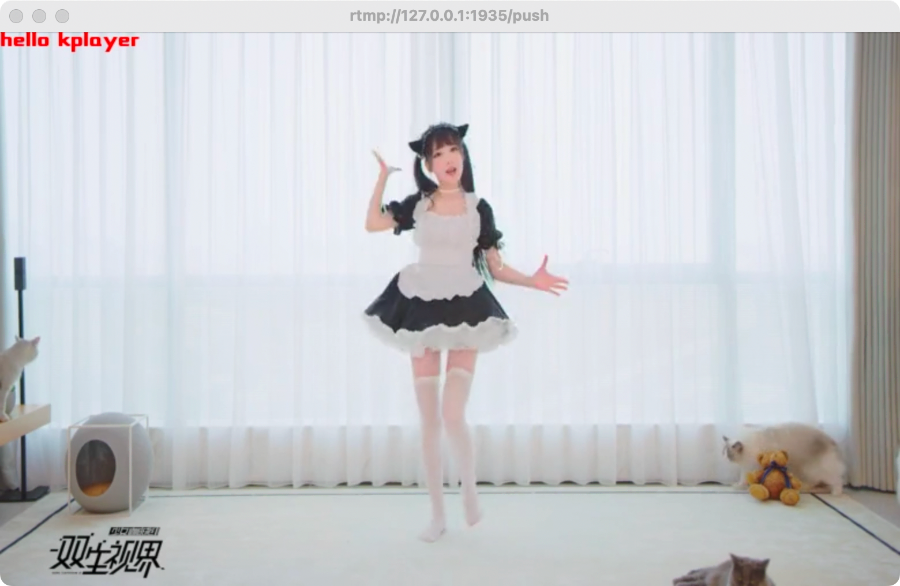

## 介绍

在视频上指定位置显示文本字符串

## 配置文件

```json
{
  "plugin": {
    "lists": [
      {
        "path": "show-text",
        "unique": "my_plugin",
        "params": {
          "text": "hello kplayer",
          "fontcolor": "red"
        }
      }
    ]
  }
}
```


## 参数列表

| 参数      | 说明                                                         | 默认值            |
| --------- | ------------------------------------------------------------ | ----------------- |
| text      | 显示文本内容，支持\n换行符                                   | none              |
| fontsize  | 字体大小                                                     | 17                |
| fontcolor | 字体颜色，支持常用颜色(red,white,black...)与RGB十六进制颜色值 | white             |
| fontfile  | 字体文件                                                     | resource/font.ttf |
| x         | 以视频左上角为原点的横坐标，最大可视范围为分辨率宽           | 0                 |
| y         | 以视频左上角为原点的纵坐标，最大可视范围为分辨率高           | 0                 |


## 示例

