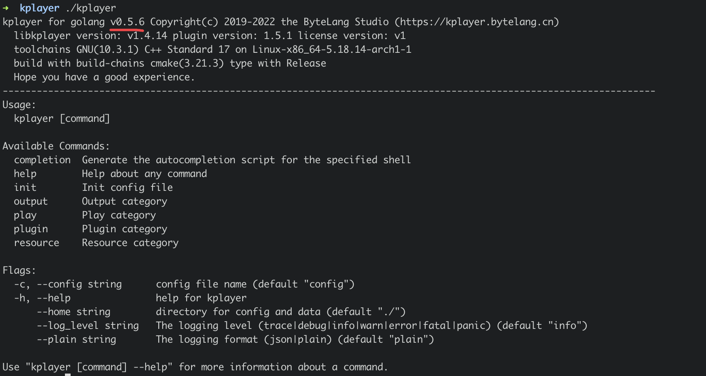

## 兼容性

`KPlayer`目前仅支持Linux环境并需要满足`x86_64(amd64)`与`aarch64(arm64)`CPU架构的硬件环境上运行，我们已经将相关依赖库静态链接至主程序中，这意味着你不需要额外的安装任何的第三方库来支持`KPlayer`的运行。

在后续的迭代版本中将会陆续针对不同CPU架构与不同的操作系统上进行跨平台支持。


## 查看满足条件

如果你想确定是否满足运行条件，可使用以下的命令来确认你的服务器是否满足以下的预期输出

1. 确保执行以下命令输出的结果相同

```shell
uname
> Linux
```


2. 确保执行以下命令输出的结果为`x86_64`或`aarch64` 

```shell
uname -m
> x86_64
```


## 下载安装

`KPlayer`提供两种方法供你获取当前版本的安装包到你的服务器中。

一键下载是我们提供的下载安装脚本，它会根据你服务器的架构版本获取相应的下载版本并解压到当前目录中。它更适合你不不需要关心服务器的架构版本。

手动下载更适合你需要下载对应架构与对应版本的构建版本。

#### 1. 使用一键下载

::: tip 提醒

一键下载始终会下载KPlayer的最新的版本，如果下载历史版本请使用第二种安装方法

:::


通过`ssh` 进入到你的服务器中，找到合适的目录并运行以下的命令进行下载

```shell
curl -fsSL get.kplayer.net | bash
```

执行完成之后输出下载进程与完整的文件列表

```shell
> curl -fsSL get.kplayer.net | bash
% Total    % Received % Xferd  Average Speed   Time    Time     Time  Current
                                 Dload  Upload   Total   Spent    Left  Speed
100 24.4M  100 24.4M    0     0  7377k      0  0:00:03  0:00:03 --:--:-- 7379k
kplayer/
kplayer/kplayer
kplayer/config.json.example
```


#### 2. 手动下载压缩包

::: tip 提醒

手动下载请确认你的服务器CPU架构版本与目标下载地址相符合

:::


在这里查看当前版本[下载地址](/overview/download)，选择服务器上http客户端程序下载到本地来。如果你的机器架构为`amd64`，以下是它的实例命令

```shell
wget http://download.bytelang.cn/kplayer-v0.5.8-linux_amd64.tar.gz
```

等待文件下载完成，你就得到了对应下载版本的压缩包。执行解压操作

```shell
tar zxvf kplayer-v0.5.8-linux_amd64.tar.gz
```


## 完成下载

如果你成功的完成的上述的步骤，至此`KPlayer`已安装到你的服务器中。

执行`cd kplayer`进入到kplayer文件夹中查看文件列表`ls -lh`将会看到所有文件的输出

```shell
-rw-r--r-- 1 root root 285 3月  23 18:23 config.json.example
-rwxr-xr-x 1 root root 27M 7月  29 11:12 kplayer
```


## 查看当前版本号

对已下载的`KPlayer`查看当前版本号，运行以下命令。查看主版本号

```shell
./kplayer
```


